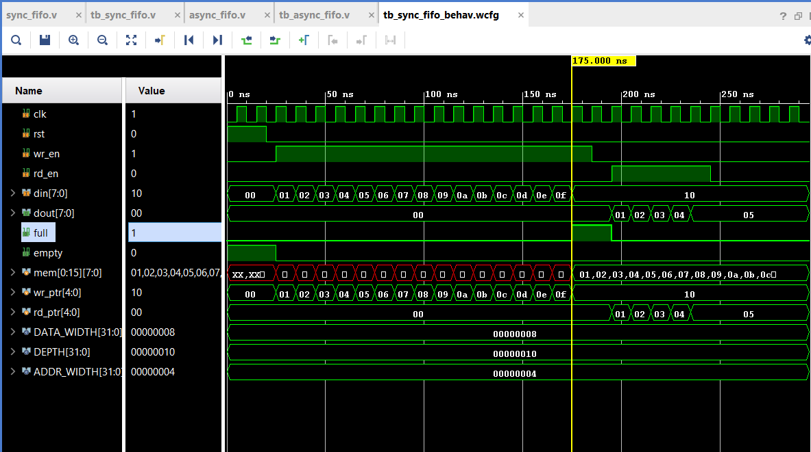
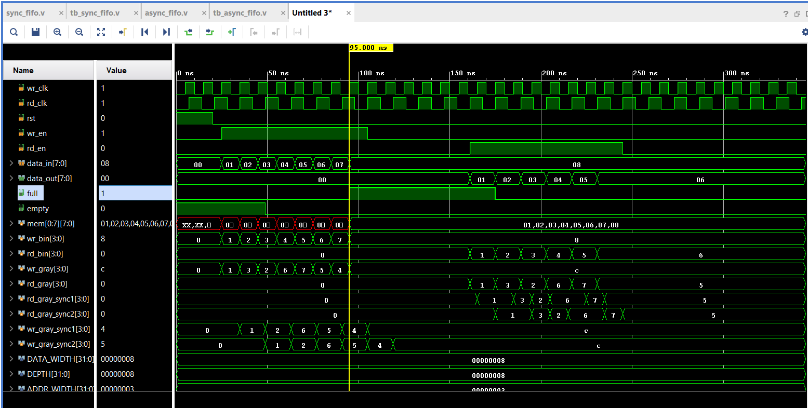

# RTL Design: Synchronous and Asynchronous FIFO

## Overview
This project implements both Synchronous and Asynchronous FIFO architectures in Verilog HDL.

The design focuses on reliable data transfer and proper clock domain crossing (CDC) handling.

## Features

### Synchronous FIFO
- Single clock domain
- Write and Read pointer logic
- Full and Empty flag generation

### Asynchronous FIFO
- Dual clock domain architecture
- Binary to Gray and Gray to Binary conversion
- Two flip-flop synchronizers for CDC
- Full and Empty flag logic

## Simulation
 - The synchronous and asynchronous FIFO designs were verified using Xilinx Vivado through RTL simulation.
 - For the synchronous FIFO, full and empty boundary conditions were validated.
 - For the asynchronous FIFO, independent write and read clocks were used to verify correct clock domain crossing (CDC), along with full and empty flag behavior       through waveform analysis.

## Verification
- Functional verification using Verilog testbenches
- Waveform analysis performed using simulation tools

## Simulation Waveforms

### Synchronous FIFO

### Asynchronous FIFO

## Tools Used
- Xilinx Vivado (RTL simulation and synthesis)

## Author
Jayanth Reddy

